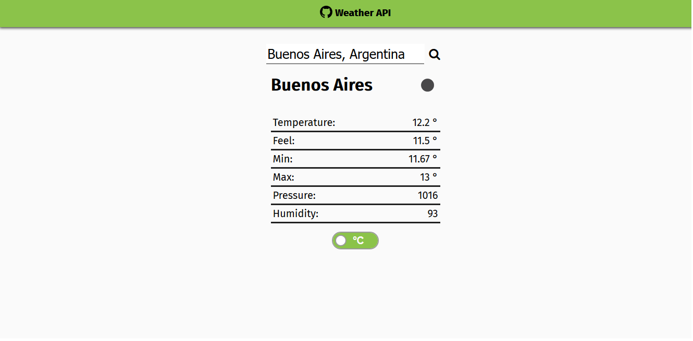

[![Contributors][contributors-shield]][contributors-url]
[![Issues][issues-shield]][issues-url]
 

  
  <h2 align="center">Weather App</h2>
  

  	JavaScript Project
     
    <a href="https://github.com/Fig77/weather-ap"><strong>Explore the docs »</strong></a>
     

<!-- ABOUT THE PROJECT -->
This project is a WeatherApp that will take information out of [OpenWeather](https://openweathermap.org/) and displays it into this web application, based on a location input from the user. Using JavaScript.

<!-- TABLE OF CONTENTS -->
## Table of Contents

* [Built With](#built-with)
* [Installation](#installation-and-setup)
	* [Requirements](#perquisites)
* [Live Version](#live-version-and-usage)
* [Future improvements](#future-improvements)
* [License](#license)
* [Contact](#contact)

### Built With
This project was built with: 
* JavaScript
* ESlint
* Webpack
* SASS (for grid structure)
* HTML/CSS
* Open weather API

## Installation

### Prerequisites
 The development environment uses `HTML/CSS | JS | Webpack`. Installation of Webpack is quite necessary for working in development enviroment.
  - Webpack - Follow [this guide](https://webpack.js.org/guides/installation/).

---

1. You can download the zip project clicking [here](https://github.com/Fig77/weather-ap.git) or you can clone the project using the command - git clone <https://github.com/Fig77/weather-ap.git>
2. Use the following commands: 

- `$ npm install` For installing dependencies.
- `$ npm run build` Will build src into dist.
- `$ npm run dev` Will let --watch working while developing.

3. Work as normal with HTML/CSS - JS editor.

### Live Version and Usage

* Current live version [here](https://github.com/Fig77/Weather-API)
* Write a location in the search bar, and press enter or the search link.
* Input can take several formats, but the one recommended is 'City, Country'.
* You can switch from Celsius to Fahrenheit by clicking the switch button below. No need to redo the search.

<!-- ROADMAP -->

## Future improvements

See the [open issues ](https://github.com/Fig77/weather-ap/issues)for a list of proposed features (and known issues).

<!-- CONTACT -->
## Contact📱

* Facundo Iglesias - [Github profile](https://github.com/Fig77)
* Email - fig.igle@gmail.com
* LinkedIn - https://linkedin.com/in/figlesias.com

<!-- MARKDOWN LINKS & IMAGES -->
<!-- https://www.markdownguide.org/basic-syntax/#reference-style-links -->
[contributors-shield]: https://img.shields.io/badge/Contributors-1-brightgreen
[contributors-url]: https://github.com/Fig77/weather-ap/graphs/contributors
[issues-shield]: https://img.shields.io/badge/issues-0-%2300ff00
[issues-url]: https://github.com/Fig77/weather-ap/issues
[product-screenshot]: assets/menu.png
